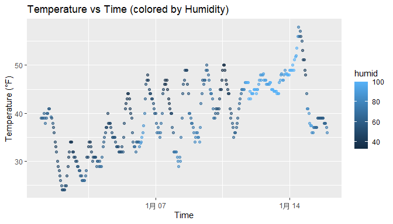

p8105_hw1_JZ3898
================
Jiaqi Zhu (jz3898)
2025-09-21

# Problem 1

``` r
library(moderndive)
library(ggplot2)

data("early_january_weather")
```

The `early_january_weather` dataset contains **358** rows and **15**
columns.  
The variables included in the dataset are:

origin, year, month, day, hour, temp, dewp, humid, wind_dir, wind_speed,
wind_gust, precip, pressure, visib, time_hour.

Key variables include: - `temp`: air temperature in Fahrenheit (range:
24.08 to 57.92) - `humid`: relative humidity as a percentage (range:
32.86 to 100) - `time_hour`: timestamps (first: 2013-01-01 01:00:00,
last: 2013-01-15 23:00:00)

The mean temperature is **39.6** °F.

------------------------------------------------------------------------

## Scatterplot of temperature vs time

``` r
ggplot(early_january_weather, aes(x = time_hour, y = temp, color = humid)) +
  geom_point(alpha = 0.6) +
  labs(
    title = "Temperature vs Time (colored by Humidity)",
    x = "Time",
    y = "Temperature (°F)"
  )
```

<!-- -->

``` r
ggsave("scatterplot_temp_vs_time.png", width = 7, height = 4)
```

From the scatterplot, we can see that temperature gradually increases
over time, ranging roughly from the low 30s °F to the mid-50s °F. The
points are colored by humidity, with lighter shades indicating higher
humidity. Periods of higher humidity tend to coincide with higher
temperatures, especially toward the later dates, while lower humidity
values are more common when temperatures are cooler.

# Problem 2

``` r
library(tidyverse)

set.seed(1234)  # for reproducibility

# Create components
num_vec = rnorm(10)
logical_vec = num_vec > 0
char_vec = letters[1:10]
factor_vec = factor(c("low", "med", "high", "low", "high", "med", "low", "med", "high", "low"))

# Combine into data frame
df = data.frame(
  num = num_vec,
  logical = logical_vec,
  character = char_vec,
  factor = factor_vec
)
df
```

    ##           num logical character factor
    ## 1  -1.2070657   FALSE         a    low
    ## 2   0.2774292    TRUE         b    med
    ## 3   1.0844412    TRUE         c   high
    ## 4  -2.3456977   FALSE         d    low
    ## 5   0.4291247    TRUE         e   high
    ## 6   0.5060559    TRUE         f    med
    ## 7  -0.5747400   FALSE         g    low
    ## 8  -0.5466319   FALSE         h    med
    ## 9  -0.5644520   FALSE         i   high
    ## 10 -0.8900378   FALSE         j    low

We created a data frame with 10 rows and 4 columns:

- `num`: numeric values sampled from a standard normal distribution
- `logical`: TRUE if num \> 0, FALSE otherwise  
- `character`: the first 10 lowercase letters
- `factor`: a categorical variable with three levels: “low”, “med”, and
  “high”

``` r
mean(pull(df, num))
```

    ## [1] -0.3831574

``` r
mean(pull(df, logical))
```

    ## [1] 0.4

``` r
# The following will not work:
# mean(pull(df, character)) 
# mean(pull(df, factor))    
```

The numeric and logical variables can be averaged. For logical, R treats
TRUE as 1 and FALSE as 0, so the mean reflects the proportion of values
greater than 0.

However, character and factor variables cannot be averaged directly, as
they are not numeric types.

We now try coercing each variable using as.numeric():

``` r
as.numeric(df$logical)
```

    ##  [1] 0 1 1 0 1 1 0 0 0 0

``` r
as.numeric(df$character)
```

    ## Warning: NAs introduced by coercion

    ##  [1] NA NA NA NA NA NA NA NA NA NA

``` r
as.numeric(df$factor)
```

    ##  [1] 2 3 1 2 1 3 2 3 1 2

Coercing the logical variable gives 0s and 1s, which is why we could
calculate the mean.

Coercing the character variable produces NAs and a warning, because
letters can’t be converted to numbers.

Coercing the factor variable gives the underlying integer codes of the
factor levels — for example, “low” = 1, “med” = 2, “high” = 3 — which
can be averaged, but this reflects level order, not actual meaning.

This exercise shows that while some coercions are possible and even
useful (e.g., logical to numeric), others (like character to numeric)
are inappropriate and produce missing values.
